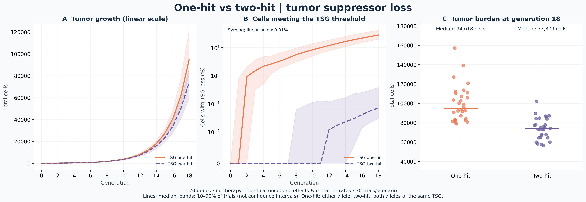
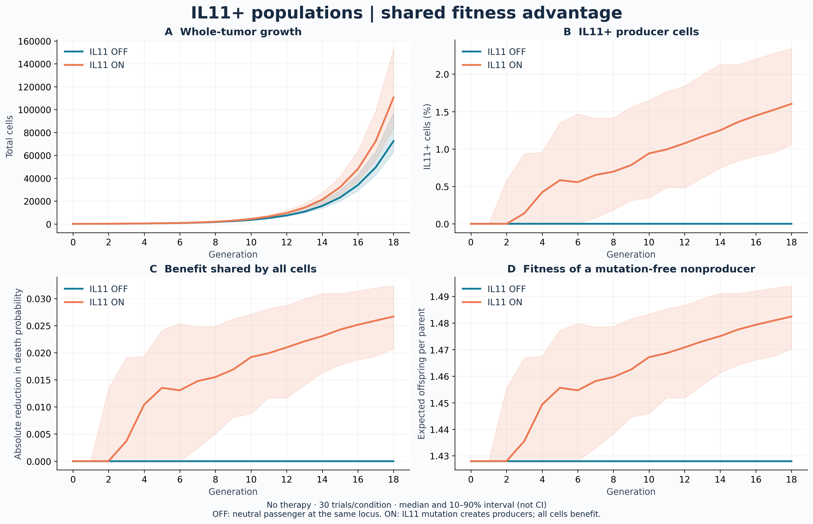
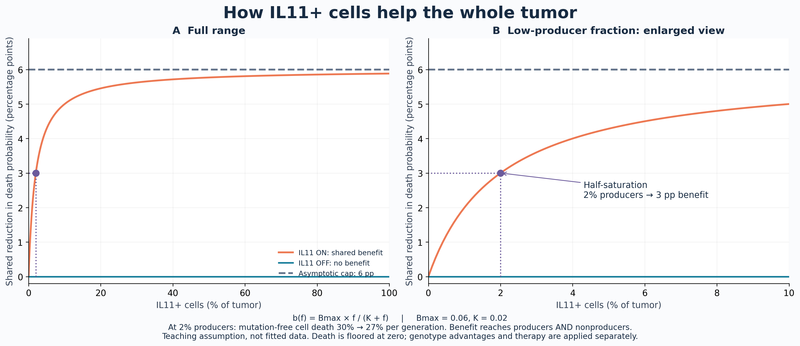

# BME 6120 — Quantitative tumor modeling

[English](#english) | [繁體中文](#繁體中文)

## English

A stochastic discrete branching model for classroom discussion. Parameters are teaching assumptions, not calibrated clinical estimates. Code documentation and comments are in Chinese; figure labels are in English for presentations without requiring Chinese fonts.

### Run without modifying conda

Use the project virtual environment directly; activation is unnecessary:

```bash
.venv/bin/python modeling_cancer.py
.venv/bin/python modeling_cancer.py --suppressor-hits 1
.venv/bin/python modeling_cancer.py --seed 123 --replicates 30 --output outputs_seed123
```

On a new computer, first create an isolated environment and install dependencies:

```bash
python3 -m venv .venv
.venv/bin/python -m pip install -r requirements.txt
```

In VS Code, select this project's `.venv/bin/python` as the Python interpreter. Packages reside in `.venv`; the default Matplotlib cache is the project's `.mplconfig` directory.

### Model assumptions

- Start with 100 unmutated cells and 20 gene loci: 3 oncogenes (Python indices 0–2), 1 resistance gene (3), 2 tumor suppressor genes / TSGs (4–5), and 14 passengers (6–19). Each TSG has two independently mutable alleles; other loci use a binary mutation state. The genotype has 22 bits representing 20 genes, not 22 genes.
- Each generation replaces each parent cell with 0, 2, or 3 offspring; the parent is not retained. With death probability `d` and probability `q` of three offspring conditional on survival, expected offspring per parent are `(1-d)*(2+q)`.
- Oncogene activation and TSG functional loss each reduce death probability and increase the probability of three offspring; these two effects add, once per category. `driver_hits` retains the separate threshold for the number of mutated oncogenes. `suppressor_hits=1` grants a TSG advantage after either allele is lost; `suppressor_hits=2` (default) requires loss of both alleles of the same TSG. One hit in each of two different TSGs does not satisfy the two-hit rule. The one-hit case is a simplified haploinsufficiency scenario, not a claim about every TSG.
- Offspring inherit mutations, and each unmutated bit independently mutates with probability `mutation_rate`. Mutations are irreversible; multiple genes may mutate in one generation. The default rate of 0.001 per bit per offspring (per allele for TSGs) is chosen for a short demonstration. Both TSG alleles can mutate in one generation. Allele loss is represented by irreversible inactivating mutations; LOH, deletions, and epigenetic silencing are not separately modeled.
- Grouping cells by genotype and sampling binomial counts is equivalent to individual-cell sampling under these assumptions, but more efficient. Identical genotypes may have different ancestors, so a genotype is not necessarily a lineage clone.
- When the tumor first reaches 20,000 cells, continuous treatment starts with the next generation transition. After natural survival, sensitive cells have a 90% additional probability of death and resistant cells have a 4% probability; combined death probability is `1-(1-d)*(1-kill)`.
- Resistance mutations can arise before or during treatment; treatment does not directly increase the mutation rate. New mutations arise in offspring and affect survival from the next generation.
- Relapse means the population first falls below its treatment-start burden and then returns to that burden. No observed relapse does not imply permanent cure.
- `max_cells` is a computational stopping threshold. The full generation that crosses it is retained; it is not a carrying capacity or population truncation. The model excludes spatial structure, immunity, resource competition, and quiescent cells.

### Figures and data

The `outputs/` directory contains:

| File | Purpose |
| --- | --- |
| `01_tumor_dashboard.png / .svg` | Cell counts, sensitive/resistant populations, genotype composition, diversity, and mutation frequencies |
| `02_scenario_comparisons.png / .svg` | Growth with no TSG advantage, TSG one-hit, or TSG two-hit; heterogeneity at different death rates |
| `03_one_hit_vs_two_hit.png / .svg` | Direct comparison: linear growth, TSG-loss fraction, and individual trial burdens at generation 18 |
| `one_hit_vs_two_hit.csv / one_hit_vs_two_hit_summary.csv` | Per-generation comparison data and endpoint medians |
| `trajectory.csv` | Generation-by-generation statistics for one treatment simulation |
| `comparisons.csv` | Replicate data, including trials that fail to reach the target size |
| `therapy_replicates.csv` | Minimum burden, relapse generation, and stopping reason across treatment trials |
| `run_metadata.json` | Parameters, random seed, and package versions |

PNG figures use 240 dpi; SVG figures scale without loss of quality. Growth curves use symlog to display zero, with an approximately logarithmic scale above 1. In the composition plot, Gxxx is the hexadecimal genotype bitmask, and R indicates a resistance mutation. Major genotypes are selected by their summed proportions across generations. TSG heatmap rows show cells with **any** allele hit, not necessarily functional loss. `suppressor_fraction` records cells meeting the selected TSG threshold; `suppressor_biallelic_fraction` records cells with both alleles lost at at least one TSG. `driver_fraction` continues to refer only to the oncogene threshold.

Growth comparisons keep oncogene effects, mutation rates, and loci identical, varying only the TSG advantage: disabled, one-hit, or two-hit. By default, growth comparisons show the median and 10th–90th percentile interval across 12 trials. This describes variation across trials, not a confidence interval. Death-rate comparisons sample 5,000 cells without replacement from the first generation to cross 5,000 cells and calculate Shannon H; horizontal bars show medians. These are equal-sized **samples**, conditional on reaching the threshold, rather than whole tumors at an exactly matched size. Trials that do not reach the threshold are excluded from H but retained in the CSV; the plot reports how many trials reached it.

### Direct one-hit versus two-hit comparison



The dedicated figure reuses the same 12 trials per scenario from the growth experiment; no therapy is applied. Panel A uses a linear cell-count axis, panel B shows the percentage meeting each scenario's TSG-loss threshold (symlog, linear below 0.01%), and panel C shows every trial at generation 18 with median bars. The threshold differs by definition; panel B measures the resulting phenotype, not an identical mutation state in both groups. Bands show trial variation, not confidence intervals. Overlap and stochastic reversals are retained rather than selecting favorable seeds.

### IL11+ populations and shared fitness

Enable the functional IL11 locus with `Config(il11_enabled=True)` or:

```bash
.venv/bin/python modeling_cancer.py --il11
```

The default is OFF. ON repurposes passenger index 6 (Gene 7) as IL11; OFF retains it as a neutral passenger, keeping 20 loci and identical mutation opportunities. Thus ON has 13 passengers plus IL11, while OFF has 14 passengers and no functional IL11 locus. A mutation marks IL11+ producers; this is a teaching assumption, not a calibrated mechanism of IL11 activation. Genotype groups may include multiple independent lineages, so “IL11+ clone” here means the producer population rather than a reconstructed ancestry.

At each generation, producer fraction `f` sets a shared absolute death-probability reduction `b = il11_max_death_reduction * f / (il11_half_fraction + f)`. Defaults are 0.06 maximum and 0.02 half-saturation. All cells, including IL11-negative cells, receive the same reduction before therapy; death probability is floored at zero. New producers affect the next transition. This assumes uniform mixing, no secretion cost, and no spatial effects or cytokine persistence. Without producers or with the switch OFF, the benefit is zero.



Every normal run generates an ON/OFF comparison without therapy over 18 generations (12 trials by default). Panels show whole-tumor growth, producer fraction, shared death reduction, and expected offspring of a mutation-free nonproducer under the current environment. The last quantity is a reference fitness calculation, not observed average growth. Matching seed numbers aid reproducibility but do not imply cell-by-cell pairing after trajectories diverge. Raw data and endpoint medians are saved to `il11_comparison.csv` and `il11_comparison_summary.csv`; figures are PNG/SVG. Other mutation and growth parameters remain identical, and trial variation is retained.

The mechanism curve below plots the exact model formula, with a full-range view and a low-producer zoom. At 2% IL11+ cells, the shared reduction is 3 **percentage points** (half of the 6-point asymptotic cap): baseline death changes from 30% to 27%. This is an absolute reduction, not a 3% relative reduction. The finite 0–100% producer range approaches but never reaches the asymptotic cap. It is a teaching assumption, not fitted experimental data. `05_il11_benefit_curve.png/.svg` and `il11_benefit_curve.csv` are generated automatically, even when the main simulation has IL11 disabled, to explain both switch states.



### Customize and reuse

Edit parameters in `Config`, or call the model from another Python program:

```python
from pathlib import Path
from modeling_cancer import Config, simulate, plot_dashboard

config = Config(suppressor_hits=1, mutation_rate=0.0005)
result = simulate(config, seed=7, therapy=True)
plot_dashboard(result, Path("my_figures"))
```

Run the allele-state, mutation-conservation, and reproducibility tests with `.venv/bin/python -m unittest -v test_modeling_cancer.py`.

The plotting functions `plot_dashboard`, `run_comparisons`, `set_plot_style`, and `save_figure` can be reused independently. The Agg backend saves figures directly without opening a GUI.

Discussion topics include how drivers change expected offspring per generation; why requiring loss of both TSG alleles delays selective advantage; how pre-existing resistant cells become dominant during treatment; and how death rate, time to target size, and mutation accumulation relate at a fixed sample size. Interpret trends using the actual outputs rather than treating one random trajectory as a universal result.

## 繁體中文

這是一個用於課堂討論的隨機離散分枝模型。參數是教學假設，未用臨床資料校準。程式及註解以中文說明，圖表使用英文標籤，方便簡報且不依賴中文字型。

### 執行（不修改 conda 環境）

直接指定專案虛擬環境，不必 activate：

```bash
.venv/bin/python modeling_cancer.py
.venv/bin/python modeling_cancer.py --suppressor-hits 1
.venv/bin/python modeling_cancer.py --seed 123 --replicates 30 --output outputs_seed123
```

如果在新電腦上使用，先以你的 Python 建立獨立環境並安裝依賴：

```bash
python3 -m venv .venv
.venv/bin/python -m pip install -r requirements.txt
```

VS Code 可將 Python interpreter 選為此資料夾的 `.venv/bin/python`。套件位於 `.venv`，Matplotlib 快取預設位於本專案的 `.mplconfig`。

### 模型假設

- 初始有 100 個未突變細胞、20 個基因座：3 個 oncogenes（Python 索引 0–2）、1 個抗藥基因（3）、2 個抑癌基因 TSG（4–5）及 14 個 passengers（6–19）。每個 TSG 各有兩個可獨立突變的等位基因，其餘基因採二元突變狀態。基因型使用 22 個位元表示 20 個基因，並非 22 個基因。
- 每一代父細胞由 0、2 或 3 個子細胞取代；不另保留父細胞。死亡機率為 `d`，存活後三子細胞機率為 `q`，因此每個父細胞的期望子代數為 `(1-d)*(2+q)`。
- Oncogene 活化與 TSG 功能喪失各自降低死亡率並提高三子細胞機率，兩類效果可相加，每類最多計算一次。`driver_hits` 保留為不同 oncogenes 的突變數門檻。`suppressor_hits=1` 表示同一 TSG 任一等位基因失活即產生優勢；`suppressor_hits=2`（預設）則需同一 TSG 的兩個等位基因都失活。不同 TSG 各一擊不符合 two-hit 條件。One-hit 是簡化的單倍劑量不足情境，不代表所有抑癌基因皆如此。
- 子細胞繼承突變，每個尚未突變位元再以 `mutation_rate` 獨立突變。無回復突變，可在同一代累積多個突變。預設每位元每子細胞突變率 0.001（TSG 為每等位基因）是為短時間演示而設定。TSG 的兩個等位基因可在同一代都突變。失活以不可逆突變表示，未另外區分雜合性缺失（LOH）、缺失或表觀遺傳沉默。
- 按基因型計數並使用二項分布抽樣，與此假設下逐細胞抽樣等價，但更有效率。同基因型可來自不同祖先，因此圖中的 genotype 並不等同於譜系 clone。
- 腫瘤首次達到 20,000 個細胞時，下一次世代轉移開始持續治療。自然存活後，敏感細胞有 90% 額外死亡機率，抗藥細胞有 4%；總死亡率為 `1-(1-d)*(1-kill)`。
- 抗藥突變可在治療前或治療期間出現；治療不會直接提高突變率。新突變在子代產生時發生，其生存優勢於下一代生效。
- 復發定義：治療後先下降至治療開始負荷以下，再回升至該負荷。未觀察到復發不代表永久治癒。
- `max_cells` 是計算停止門檻，保留跨過門檻的完整一代，不是承載量或截斷取樣。模型沒有空間、免疫、資源競爭或靜止細胞。

### 展示圖表與資料

`outputs/` 內含：

| 檔案 | 用途 |
| --- | --- |
| `01_tumor_dashboard.png / .svg` | 細胞數、敏感／抗藥族群、基因型組成、多樣性、基因突變頻率 |
| `02_scenario_comparisons.png / .svg` | 無 TSG 優勢／TSG one-hit／TSG two-hit 的生長，以及不同死亡率下的異質性 |
| `03_one_hit_vs_two_hit.png / .svg` | 直接比較線性生長、TSG 達標比例，以及第 18 代各次試驗的負荷 |
| `one_hit_vs_two_hit.csv / one_hit_vs_two_hit_summary.csv` | 逐代比較資料與終點中位數 |
| `trajectory.csv` | 單次治療模擬逐代統計 |
| `comparisons.csv` | 重複試驗數據，包含未達到指定大小的試驗 |
| `therapy_replicates.csv` | 多次治療試驗的最低負荷、復發代數、停止原因 |
| `run_metadata.json` | 參數、隨機種子與套件版本 |

PNG 為 240 dpi；SVG 可無損縮放。生長曲線使用 symlog，0 可顯示，1 以上近似對數尺度。組成圖中的 Gxxx 是基因型 bitmask 的十六進位表示，R 表示含抗藥突變；主要基因型依跨世代累積比例選出。TSG 熱圖列顯示**任一等位基因有突變**的細胞比例，不一定代表功能喪失。`suppressor_fraction` 記錄符合所選 TSG 門檻的細胞比例；`suppressor_biallelic_fraction` 記錄至少一個 TSG 雙等位基因失活的細胞比例。`driver_fraction` 仍只表示達到 oncogene 門檻的比例。

生長比較固定 oncogene 效果、突變率與基因座，只改變 TSG 優勢條件：取消優勢、一擊或兩擊。預設展示 12 次試驗的中位數及 10–90 百分位區間，這是試驗間變異，並不是信賴區間。死亡率比較使用各試驗首次跨過 5,000 細胞的世代，無放回取樣 5,000 細胞計算 Shannon H；圖上的橫線是中位數。此結果是在達門檻條件下的等大小**樣本**比較，並非精確命中該大小的完整腫瘤。未達門檻者不納入 H，但會保留於 CSV 並顯示成功試驗數。

### One-hit 與 two-hit 直接比較


專屬比較圖重用生長試驗每種情境的同一批 12 次試驗，不施加治療。A 面板以線性座標顯示細胞數，B 面板顯示各情境達到 TSG 失活門檻的細胞百分比（symlog，0.01% 以下為線性），C 面板顯示第 18 代每次試驗的負荷與中位數橫線。兩情境的門檻定義不同，B 比較的是功能表型，而非完全相同的突變狀態。陰影表示試驗間變異，不是信賴區間；保留重疊與隨機反轉，不挑選有利種子。

### IL11+ 族群與共享生長優勢

用 `Config(il11_enabled=True)` 或以下指令開啟 IL11 功能：

```bash
.venv/bin/python modeling_cancer.py --il11
```

預設為關閉。開啟時將 passenger 索引 6（Gene 7）改為 IL11；關閉時保留為中性 passenger，維持 20 個位點與相同突變機會。因此開啟時為 13 個 passengers 加 IL11，關閉時為 14 個 passengers 且沒有功能性 IL11 位點。突變後標記為 IL11+ 生產者；這是教學假設，並非經校準的 IL11 活化機制。同基因型可能來自不同祖先，因此這裡的「IL11+ clone」指生產者族群，不是重建出的家系。

每代以生產者比例 `f` 計算共享死亡率降低量：`b = il11_max_death_reduction * f / (il11_half_fraction + f)`。預設最大降低量為 0.06、半飽和比例為 0.02。所有細胞（包含 IL11 陰性細胞）都在治療前獲得同樣降低量，死亡率最低為零；新生產者從下一次轉移開始提供效果。假設環境均勻混合、沒有分泌成本、空間效應或細胞因子殘留。無生產者或開關關閉時，效果為零。


每次正常執行都會生成不施加治療、觀察 18 代的 ON／OFF 比較，預設每組 12 次試驗。四面板顯示整體生長、生產者比例、共享死亡率降低量，以及未突變非生產者在當前環境中的預期子代數；最後一項是參考 fitness 計算，不是觀察到的平均增長。相同 seed 方便重現，但族群分歧後不代表逐細胞配對。逐代資料與終點中位數存於 `il11_comparison.csv`、`il11_comparison_summary.csv`，圖表輸出 PNG／SVG。其餘突變與生長參數保持一致，並保留試驗間變異。

下圖直接畫出模型公式，包含全範圍與低生產者比例放大圖。IL11+ 細胞占 2% 時，共享死亡率降低 **3 個百分點**，即漸近上限 6 個百分點的一半：基準死亡率從 30% 降至 27%。這是絕對降低量，不是相對降低 3%。生產者比例在 0–100% 的有限範圍內會接近、但不會精確達到漸近上限。曲線是教學假設，不是實驗擬合。每次執行會自動生成 `05_il11_benefit_curve.png/.svg` 與 `il11_benefit_curve.csv`；即使主模擬關閉 IL11，也會畫出兩種開關狀態的機制供理解。


### 修改與重用

修改 `Config` 中的參數，或從其他 Python 程式呼叫：

```python
from pathlib import Path
from modeling_cancer import Config, simulate, plot_dashboard

config = Config(suppressor_hits=1, mutation_rate=0.0005)
result = simulate(config, seed=7, therapy=True)
plot_dashboard(result, Path("my_figures"))
```

執行 `.venv/bin/python -m unittest -v test_modeling_cancer.py` 可驗證等位基因狀態、突變守恆與可重現性。

繪圖函數 `plot_dashboard`、`run_comparisons`、`set_plot_style`、`save_figure` 可獨立重用。使用 Agg backend，執行後直接存檔，不彈出 GUI。

討論時可著重：driver 如何改變每代期望子代數；TSG 雙等位基因失活條件為何延遲選擇優勢；治療前已存在的抗藥細胞如何在治療後占優；相同樣本大小下，死亡率、達到大小所需代數和突變累積的關係。請以實際輸出數據解釋趨勢，避免將單一隨機案例當成普遍定律。
